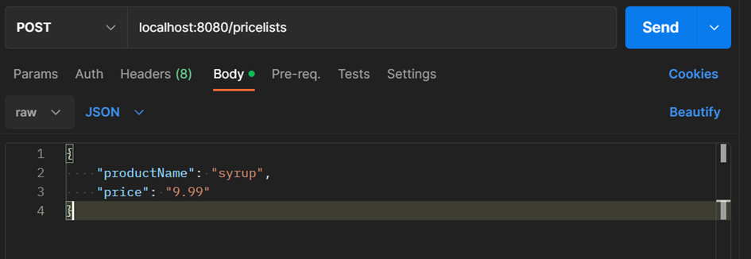
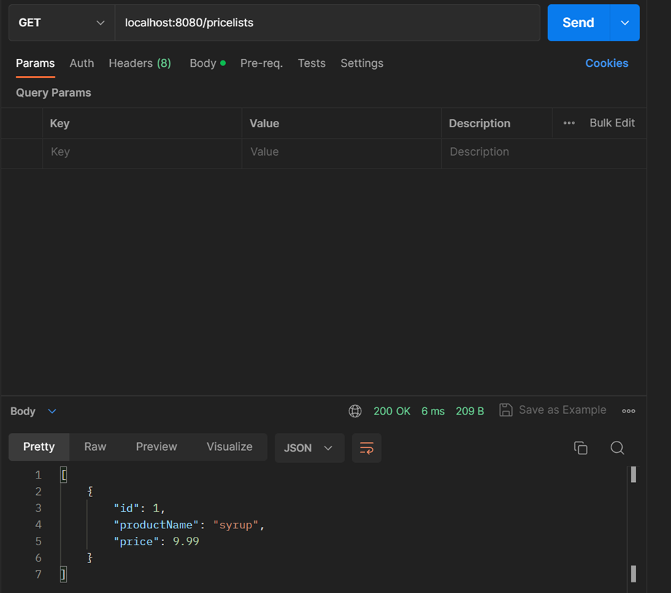

# Apteka Dbam o Zdrowie - Price List API

This project provides an API for managing price lists of medicinal products in Apteka Dbam o Zdrowie. The API allows for adding price lists and retrieving sales reports.

## Technologies Used

- Java
- Spring Boot
- Spring Data JPA
- H2 Database
- Maven

## Getting Started

To get started with the project, follow these steps:

1. Clone the repository to your local machine:

   ```bash
   git clone <repository_url>
   
2. Open a terminal or command prompt and navigate to the project directory.
3. Run the application using the following command:

   ```bash
   java -jar target/doz-0.0.1-SNAPSHOT.jar
   
4. The application will start running, and you can access the API endpoints at http://localhost:8080.
5. You can also run it from your favorite IDE.

## API Endpoints

The following API endpoints are available:

- GET /pricelists: Retrieves all price lists.
- POST /pricelists: Adds a new price list.


Usage:<br>
1. Adding a Price List<br>
To add a new price list, make a POST request to the /pricelists endpoint with the following JSON payload:
   ```json
   {
   "productName": "Product Name",
   "price": 9.99
   }
   
2. Retrieving Price Lists <br>
To retrieve all price lists, make a GET request to the /pricelists endpoint. The response will contain a list of all price lists in the database.

Api testowane za pomocą POSTMANa:


